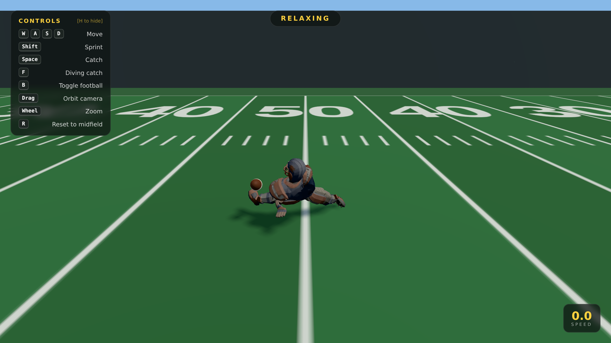

# 🏈 Gridiron Demo

A small browser-based **football-field playground** built with
[three.js](https://threejs.org/). Load up the character and run around a full
American-football field, sprint between the hash marks, and trigger catch and
diving-catch animations — all driven by the supplied rigged FBX model.



## Controls

| Input | Action |
| --- | --- |
| `W` `A` `S` `D` / arrows | Move (relative to the camera) |
| `Shift` | Sprint |
| `Space` | Catch |
| `F` | Diving catch |
| `G` | Relax (lie down on the field) |
| `B` | Toggle the held football |
| `R` | Reset to midfield |
| `H` | Show / hide the controls panel |
| Mouse drag | Orbit the camera |
| Mouse wheel | Zoom in / out |

On touch devices, drag the **left half** of the screen as a virtual joystick,
drag the **right half** to orbit the camera, and use the on-screen
**SPRINT / CATCH / DIVE** buttons.

## Running it

The model is loaded over `fetch`, so the page must be served over HTTP
(opening `index.html` directly via `file://` will be blocked by the browser).
Any static file server works:

```bash
# Python (no install needed)
python3 -m http.server 8080

# or Node
npx serve .
```

Then open <http://localhost:8080>.

## How it works

- **`assets/player.fbx`** — the rigged character with five embedded animation
  clips: `relax`, `walk`, `run`, `Football Catch`, and a parkour swan-dive used
  for the diving catch. The clips are matched to friendly action names by keyword
  in `src/main.js` (`CLIP_KEYS`).
- The model has **no dedicated standing-idle clip** — its only idle is `relax`,
  a 17-second lie-down-on-the-grass animation. So the default idle is
  synthesized by freezing a neutral, feet-together frame of the walk cycle
  (`IDLE_POSE_TIME`) with a subtle breathing bob, and the lie-down `relax` is
  kept as an optional move on the `G` key.
- The bundled `move_run` clip is also unusable as a sprint — the character runs
  nearly horizontal, as if flying — so **sprinting reuses the walk cycle**, sped
  up (`SPRINT_ANIM_RATE`) with a forward torso lean (`SPRINT_LEAN`), which reads
  as a believable run while keeping the character upright.
- The locomotion clips are **in-place** (no root motion), so movement is driven
  by code and the animation simply plays underneath. Idle → walk → sprint are
  cross-faded based on input and the sprint key; catch and dive are one-shot
  actions (`LoopOnce`, `clampWhenFinished`) that blend back into locomotion when
  they finish.
- The character is auto-scaled to ~1.8 units tall and its feet are dropped to
  the ground on load, so the demo is independent of the FBX's native units.
- The football is a procedural prolate spheroid attached to the rig's `R_Hand`
  bone.
- The field — turf stripes, yard lines, hash marks, numbers and end-zone
  wordmarks — is drawn procedurally onto a canvas texture (`makeFieldTexture`),
  with goal posts, grandstands and an instanced "crowd" for atmosphere.

## Project layout

```
index.html          page shell, import map, HUD markup
src/style.css        HUD / loading-screen styling
src/main.js          scene, field, input, camera and animation logic
assets/player.fbx    rigged + animated character (embedded textures)
vendor/three/         pinned three.js r160 build + FBXLoader and deps
```

three.js is vendored locally (no CDN / network needed at runtime) so the demo
is fully self-contained.
